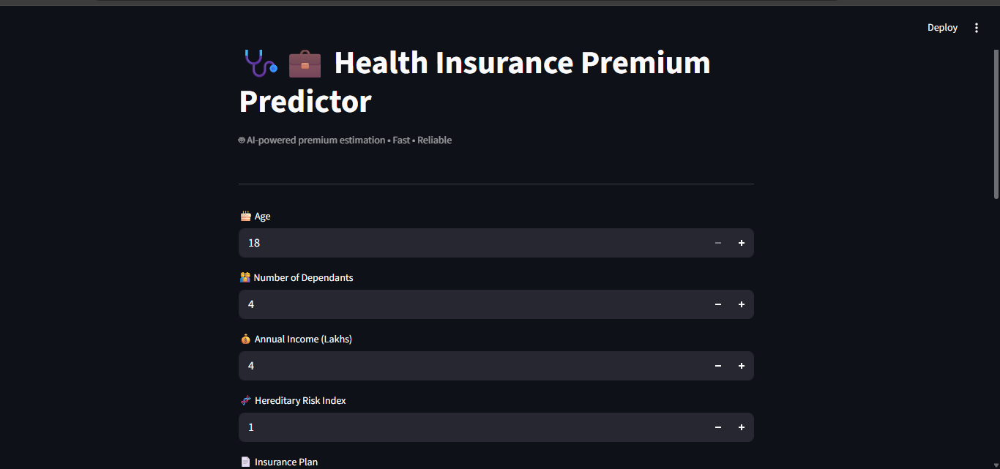
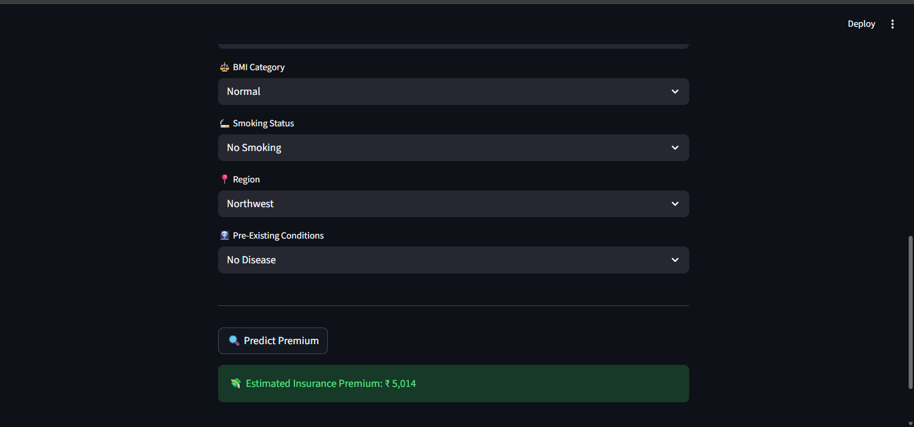

# Health Insurance Premium Prediction System

A production-ready machine learning application that predicts health insurance premiums based on user demographics, lifestyle factors, and medical history.

The system follows a clean architecture with:
- FastAPI for model inference (backend)
- Streamlit for user interaction (frontend)
- Fully decoupled API and UI layers

---

## Project Overview

Health insurance premium estimation depends on multiple factors such as age, income, medical conditions, and lifestyle habits.
This project uses trained machine learning models to provide fast and reliable premium predictions via a REST API.

---

Project Snap-Shots





## Key Features

- Machine learning–based premium prediction
- Separate models for different age groups
- FastAPI-powered inference service
- Streamlit-based interactive UI
- Clean modular project structure
- Cloud-deployment ready

---

## System Architecture

User → Streamlit UI → FastAPI API → ML Model + Scalers

---

## Project Structure
````
health_insurance_premium_prediction/
├── api/
│   ├── main.py
│   ├── inference.py
│   └── schemas.py
├── ui/
│   └── app.py
├── artifacts/
├── tests/
├── requirements.txt
├── README.md
└── LICENSE

---

## Run Locally

1. Install dependencies:
   pip install -r requirements.txt

2. Start API:
   uvicorn api.main:app --reload

3. Start UI:
   streamlit run ui/app.py

---

## License

MIT License
